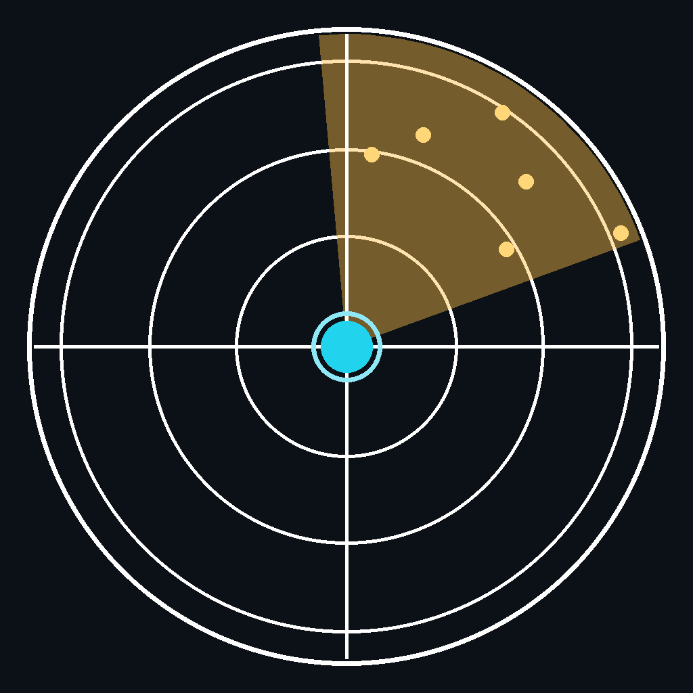
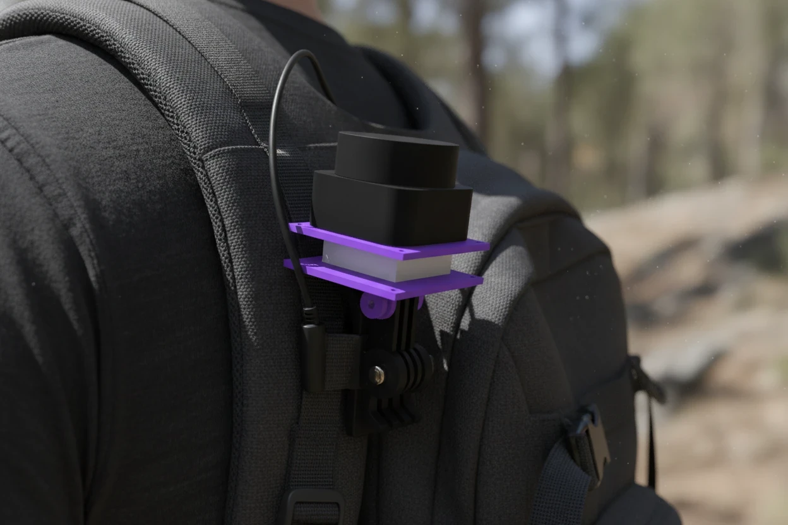

  

<h1 align="center">LidarMapper</h1>

백팩을 메고 걷기만 하면, 그 공간이 지도가 됩니다.

---

## 이게 뭔가요?

**Portable LiDAR Mapper**는 라이다 센서를 백팩 어깨끈에 달고 다니면서, 실내
공간(집·사무실 등)을 걷는 것만으로 2D 지도를 자동으로 그려주는 개인용
프로젝트입니다. 로봇청소기가 집 구조를 스스로 파악하는 것과 같은 원리를,
사람이 직접 메고 다니는 방식으로 구현했습니다.

- **하드웨어**: RPLIDAR C1(라이다 센서) + Orange Pi 4 Pro(소형 컴퓨터)를
  어깨끈에 장착
- **동작 방식**: 걸어 다니면 라이다가 주변까지의 거리를 초당 수천 번 측정하고,
  SLAM(동시 위치추정 및 지도작성) 알고리즘이 그 데이터를 실시간으로 하나의
  지도로 이어붙입니다
- **이 앱(LidarMapper)의 역할**: 그 장비와 와이파이로 통신해서, 폰 화면에서
  실시간 스캔 상태를 레이더처럼 보고, 완성돼 가는 지도를 확인하고, 원할 때
  저장하는 컨트롤러/뷰어입니다

  

## 이 저장소는 무엇인가요?

이 저장소는 **소스 코드가 아니라 완성된 앱(APK) 배포 전용**입니다. 실제
개발은 별도의 비공개 저장소에서 진행되고, 커밋될 때마다 GitHub Actions가
자동으로 앱을 빌드해서 여기 [Releases](../../releases/latest)에 최신 APK를
올려둡니다. 앱 안의 **설정 → 업데이트 확인** 메뉴가 바로 이 저장소를 확인해서
새 버전을 받아옵니다.

## 설치 방법

1. [Releases 페이지](../../releases/latest)에서 `app-release.apk` 다운로드
2. 안드로이드에서 "출처를 알 수 없는 앱 설치" 허용 후 설치
3. 이후부터는 앱 안에서 **설정 → 업데이트 확인**으로 최신 버전 유지

---

## 앱 버전 히스토리

<!--
새 빌드를 릴리스할 때마다 위쪽에 새 항목을 추가해주세요.
형식: ## YYYY-MM-DD — 한줄 요약
-->

### 2026-09-22 — 첫 공개 빌드
- 4탭 구조(홈/트래킹/목록/설정) 기본 골격
- **홈**: 라이다·IMU·Orange Pi·배터리·네트워크·전원 상태 진단 카드
- **트래킹**: 실시간 라이다 스캔 레이더 뷰 + 누적 지도(핀치줌, 1m 격자,
  색상 테마 선택), 지도 저장 기능
- **목록**: 저장된 세션 조회
- **설정**: 지도 색상/격자선 커스터마이징, 앱 내 업데이트 확인
- rosbridge(WebSocket)로 Orange Pi와 통신, 연결 끊김 시 자동 재연결
